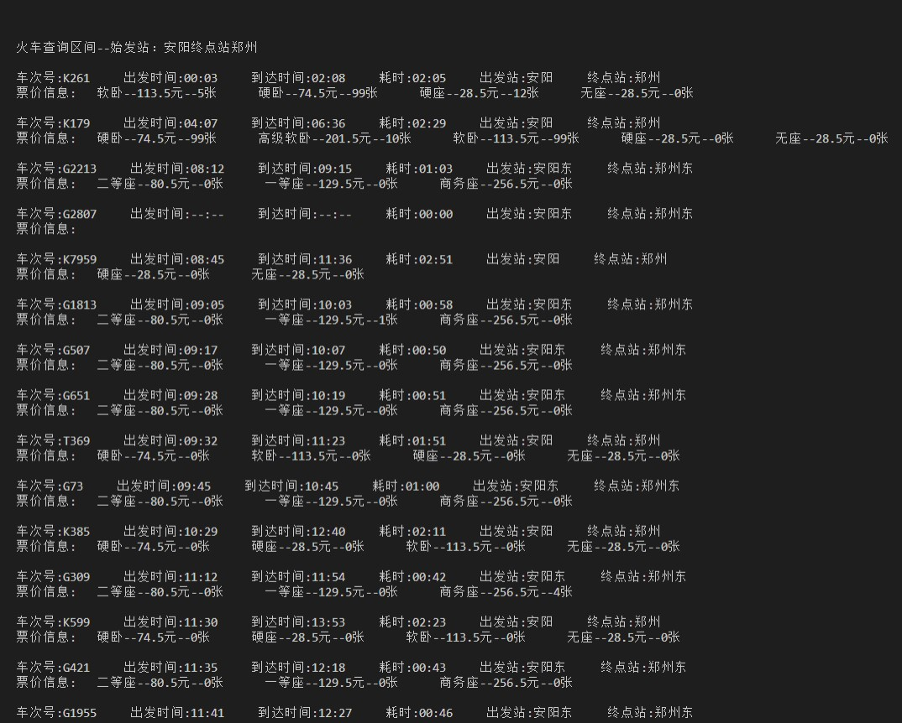
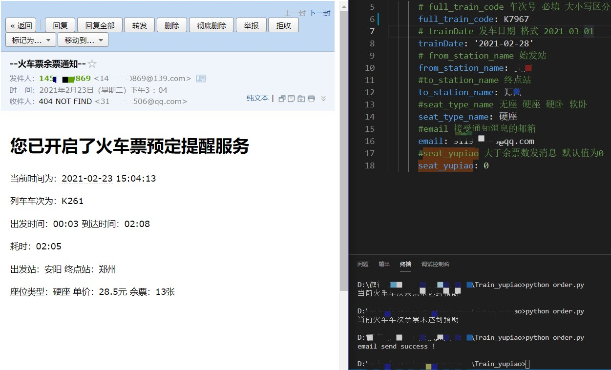

# 火车票余票查询
> 借助于美团火车票API来实现火车票查询以及邮件提醒

-----------

20231010更新：

​	更改邮件发送，摒弃api接口发邮件的缺点。使用公共smtplib库来发送邮件，将配置信息同步到config.yml进行处理。

--------

## Introduce

春运返工来临，火车票不好买。写个爬虫配合邮箱提醒服务，来获取火车票的余票信息。

## Code

train.py  :  查询火车余票信息

order.py : 余票查询提醒服务，email api

station.txt: 用于记录车站和编码的对应关系

config.yml: 配置信息

## How to use

仅仅查询余票：

> python train.py

某车次某座位类型，有票则发邮箱：

> python order.py

源代码分享一下，共同进步学习。

仓库地址：https://github.com/blueweiwei/Train_yupiao